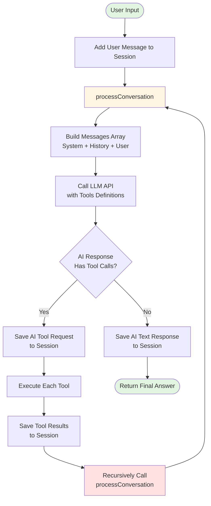

# MiniCC - Minimal Claude Code

A minimal implementation of Claude Code for learning and understanding how AI programming assistants work.

## Introduction

MiniCC (Minimal Claude Code) is an educational AI code assistant, similar to what Minix is to Linux. It provides a clean framework to help developers understand how to build intelligent programming assistants and is designed as an easily extensible agent skeleton.

## Features

- 🛠️ **Tool System**: Extensible tool architecture supporting file operations, command execution, code search
- 🤖 **LLM Integration**: Supports OpenAI API compatible large language models  
- 📝 **Session Management**: Maintains context for multi-turn conversations
- 🔄 **Recursive Execution**: AI autonomously completes multi-step tasks
- 🎯 **Customizable System Prompt**: Easily modify AI behavior via `.minicc/system_prompt.md`
- 📚 **Learning Friendly**: Clean code with clear architecture, perfect for learning

## Architecture

```
minicc/
├── packages/
│   ├── core/           # Core functionality
│   │   ├── llm/       # LLM client
│   │   ├── tools/     # Tool implementations
│   │   └── services/  # Business services
│   └── cli/           # Command line interface
│       └── commands/  # CLI commands
├── .minicc/           # Configuration
│   └── system_prompt.md  # Customizable system prompt
└── .history/          # Session history storage
```

## How It Works - Recursive Execution Flow

The core innovation is the recursive tool execution that allows AI to complete multi-step tasks autonomously:



### Key Points:

1. **Single Entry Point**: All interactions go through `processConversation()`
2. **AI-Driven Flow**: The AI decides when to use tools and when to stop
3. **Natural Termination**: When AI returns text without tools, the recursion ends
4. **Stateful Sessions**: All messages (user, assistant, tool results) are preserved

## Quick Start

### 1. Clone the repository

```bash
git clone https://github.com/yinwm/minicc.git
cd minicc
```

### 2. Install dependencies

```bash
pnpm install
```

### 3. Configure environment

Create a `.env` file in the project root:

```env
OPENAI_API_KEY=your-api-key-here
OPENAI_BASE_URL=https://api.openai.com/v1  # Or other compatible API
MODEL=gpt-4  # Or other model
```

### 4. Build project

```bash
pnpm build
```

### 5. Run

```bash
# Interactive chat mode
pnpm chat

# Single query
pnpm query "List all files in current directory"

# With session management
pnpm sessions --list
```

## Core Tools

### File Operations
- `file_read`: Read file contents
- `file_write`: Write entire file
- `file_list`: List directory files

### File Editing
- `file_edit`: Find and replace content
- `file_insert`: Insert at specific line
- `file_delete_lines`: Delete line ranges

### Execution
- `shell_execute`: Execute system commands
- `code_search`: Search patterns in code

## Customization

### System Prompt

Customize AI behavior by editing `.minicc/system_prompt.md`:

```bash
vim .minicc/system_prompt.md
```

The file uses Markdown format for easy editing and version control. Changes are applied on next run.

### Adding New Tools

1. Create a tool class extending `BaseTool`:

```typescript
import { BaseTool, ToolExecutionResult } from './base.tool';

export class MyTool extends BaseTool {
  name = 'my_tool';
  description = 'My custom tool';
  
  parameters = {
    type: 'object',
    properties: {
      input: { type: 'string' }
    },
    required: ['input']
  };
  
  async execute(args: any): Promise<ToolExecutionResult> {
    // Implement your logic
    return { success: true, data: 'result' };
  }
}
```

2. Register in tool registry

## Usage Examples

### Interactive Mode

```bash
$ pnpm chat

╭───────────────────────────────────────╮
│   MiniCC - AI Programming Assistant   │
│   Type "exit" or "quit" to leave      │
│   Type "help" for help                │
╰───────────────────────────────────────╯

✓ Loaded system prompt from .minicc/system_prompt.md

Your question: Read README.md and summarize it
```

### Command Examples

```bash
# File operations
pnpm query "Read package.json"
pnpm query "List all TypeScript files"
pnpm query "Search for TODO comments"

# Code modifications
pnpm query "Add a comment to main function"
pnpm query "Fix the import statements"

# Shell operations
pnpm query "Run npm test"
pnpm query "Check git status"
```

## Project Scripts

```bash
pnpm build    # Build all packages
pnpm chat     # Start interactive mode
pnpm query    # Execute single query
pnpm sessions # Manage sessions
pnpm clean    # Clean build artifacts
```

## Learning Resources

- **Tool System**: See `packages/core/src/tools/` for tool implementations
- **LLM Integration**: Check `packages/core/src/llm/` for API integration
- **Session Management**: Review `packages/core/src/services/session.service.ts`
- **CLI Structure**: Explore `packages/cli/src/commands/` for CLI implementation

## FAQ

**Q: How to use other LLMs?**  
A: Set `OPENAI_BASE_URL` to any OpenAI-compatible API endpoint (e.g., Ollama, LM Studio, SiliconFlow)

**Q: Where are sessions stored?**  
A: In `.history/` directory, automatically created on first run

**Q: How to reset the system prompt?**  
A: Edit `.minicc/system_prompt.md` or delete it to use defaults

**Q: Can I use this in production?**  
A: MiniCC is designed for learning. For production, use official Claude Code or mature alternatives

## Contributing

Contributions welcome! Focus on:
- Clear, educational code
- Tool extensions
- Documentation improvements
- Bug fixes

## License

MIT

---

> 💡 **Note**: MiniCC is an educational project for understanding AI assistants. For production use, consider official solutions.

## Links

- [中文文档](README_CN.md)
- [System Prompt Guide](SYSTEM_PROMPT.md)
- [GitHub Issues](https://github.com/yinwm/minicc/issues)