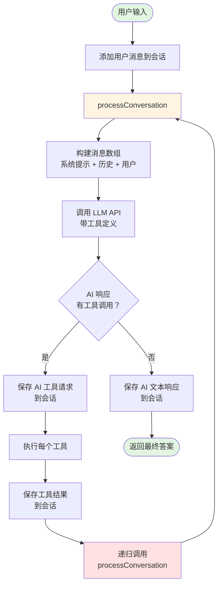

# MiniCC - 极简 Claude Code 实现

一个用于学习和理解 AI 编程助手工作原理的极简 Claude Code 实现。

## 简介

MiniCC（Minimal Claude Code）是一个教育性的 AI 代码助手，它之于 Claude Code 就像 Minix 之于 Linux。它提供了一个清晰的框架，帮助开发者理解如何构建智能编程助手，并设计为易于扩展的智能体骨架。

## 特性

- 🛠️ **工具系统**：可扩展的工具架构，支持文件操作、命令执行、代码搜索
- 🤖 **LLM 集成**：支持 OpenAI API 兼容的大语言模型
- 📝 **会话管理**：保持多轮对话的上下文
- 🔄 **递归执行**：AI 自主完成多步骤任务
- 🎯 **可定制系统提示**：通过 `.minicc/system_prompt.md` 轻松修改 AI 行为
- 📚 **学习友好**：代码清晰，架构简洁，非常适合学习

## 架构

```
minicc/
├── packages/
│   ├── core/           # 核心功能
│   │   ├── llm/       # LLM 客户端
│   │   ├── tools/     # 工具实现
│   │   └── services/  # 业务服务
│   └── cli/           # 命令行界面
│       └── commands/  # CLI 命令
├── .minicc/           # 配置目录
│   └── system_prompt.md  # 可定制的系统提示
└── .history/          # 会话历史存储
```

## 工作原理 - 递归执行流程

核心创新是递归工具执行，让 AI 能够自主完成多步骤任务：



### 关键点：

1. **单一入口**：所有交互都通过 `processConversation()`
2. **AI 驱动流程**：AI 决定何时使用工具，何时停止
3. **自然终止**：当 AI 返回纯文本无工具调用时，递归结束
4. **有状态会话**：所有消息（用户、助手、工具结果）都被保留

## 快速开始

### 1. 克隆仓库

```bash
git clone https://github.com/yinwm/minicc.git
cd minicc
```

### 2. 安装依赖

```bash
pnpm install
```

### 3. 配置环境

设置环境变量：

```bash
# 临时设置（当前会话）
export OPENAI_API_KEY=your-api-key-here
export OPENAI_BASE_URL=https://api.openai.com/v1  # 或其他兼容 API
export MODEL=gpt-4  # 或其他模型

# 或直接运行
OPENAI_API_KEY=your-api-key-here OPENAI_BASE_URL=https://api.openai.com/v1 pnpm chat

# 永久设置（添加到 ~/.bashrc 或 ~/.zshrc）
echo 'export OPENAI_API_KEY=your-api-key-here' >> ~/.bashrc
echo 'export OPENAI_BASE_URL=https://api.openai.com/v1' >> ~/.bashrc
```

### 4. 构建项目

```bash
pnpm build
```

### 5. 运行

```bash
# 交互式聊天模式
pnpm minicc

# 单次查询
pnpm minicc -p "列出当前目录所有文件"

# 会话管理
pnpm sessions --list
```

## 核心工具

### 文件操作

- `file_read`：读取文件内容
- `file_write`：写入整个文件
- `file_list`：列出目录文件

### 文件编辑

- `file_edit`：查找和替换内容
- `file_insert`：在指定行插入内容
- `file_delete_lines`：删除行范围

### 执行工具

- `shell_execute`：执行系统命令
- `code_search`：搜索代码模式

## 自定义配置

### 系统提示

通过编辑 `.minicc/system_prompt.md` 来自定义 AI 行为：

```bash
vim .minicc/system_prompt.md
```

文件使用 Markdown 格式，方便编辑和版本控制。修改后下次运行时自动生效。

### 添加新工具

1. 创建继承 `BaseTool` 的工具类：

```typescript
import { BaseTool, ToolExecutionResult } from './base.tool';

export class MyTool extends BaseTool {
  name = 'my_tool';
  description = '我的自定义工具';

  parameters = {
    type: 'object',
    properties: {
      input: { type: 'string' }
    },
    required: ['input']
  };

  async execute(args: any): Promise<ToolExecutionResult> {
    // 实现你的逻辑
    return { success: true, data: 'result' };
  }
}
```

2. 在工具注册表中注册

## 使用示例

### 交互模式

```bash
$ pnpm minicc

╭───────────────────────────────────────╮
│   MiniCC - AI 编程助手                │
│   输入 "exit" 或 "quit" 退出          │
╰───────────────────────────────────────╯

✓ 已加载系统提示 .minicc/system_prompt.md

您的问题：读取 README.md 并总结
```

### 命令示例

```bash
# 文件操作
pnpm minicc -p "读取 package.json"
pnpm minicc -p "列出所有 TypeScript 文件"
pnpm minicc -p "搜索 TODO 注释"

# 代码修改
pnpm minicc -p "给 main 函数添加注释"
pnpm minicc -p "修复 import 语句"

# Shell 操作
pnpm minicc -p "运行 npm test"
pnpm minicc -p "检查 git 状态"
```

## 项目脚本

```bash
pnpm build     # 构建所有包
pnpm minicc    # 启动交互模式
pnpm minicc -p # 执行单次查询
pnpm sessions  # 管理会话
pnpm clean     # 清理构建产物
```

## 学习资源

- **工具系统**：查看 `packages/core/src/tools/` 了解工具实现
- **LLM 集成**：查看 `packages/core/src/llm/` 了解 API 集成
- **会话管理**：查看 `packages/core/src/services/session.service.ts`
- **CLI 结构**：查看 `packages/cli/src/commands/` 了解 CLI 实现

## 常见问题

**问：如何使用其他 LLM？**  
答：设置 `OPENAI_BASE_URL` 为任何 OpenAI 兼容的 API 端点（如 Ollama、LM Studio、SiliconFlow）

**问：会话存储在哪里？**  
答：在 `.history/` 目录中，首次运行时自动创建

**问：如何重置系统提示？**  
答：编辑 `.minicc/system_prompt.md` 或删除它以使用默认值

**问：可以用于生产环境吗？**  
答：MiniCC 是为学习设计的。生产环境请使用官方 Claude Code 或其他成熟方案

## 贡献指南

欢迎贡献！重点关注：

- 清晰的教学性代码
- 工具扩展
- 文档改进
- Bug 修复

## 许可证

MIT

---

> 💡 **注意**：MiniCC 是一个用于理解 AI 助手的教育项目。生产使用请考虑官方解决方案。

## 链接

- [English Documentation](README.md)
- [系统提示指南](SYSTEM_PROMPT.md)
- [GitHub Issues](https://github.com/yinwm/minicc/issues)
